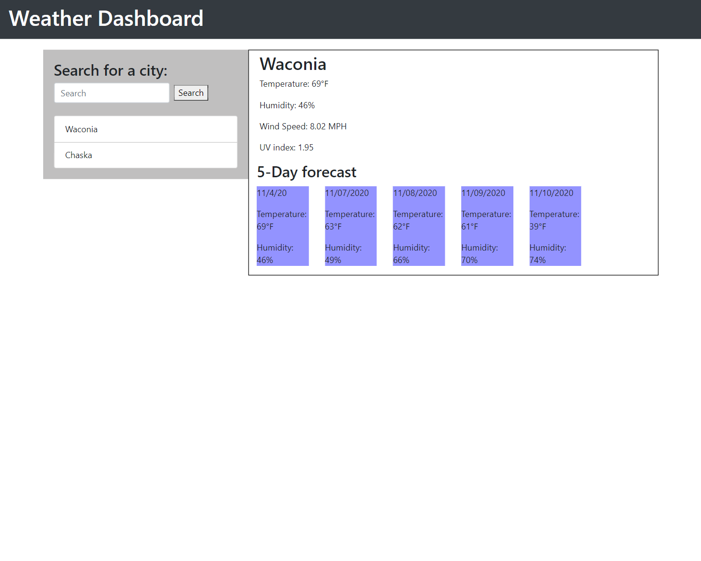

# 06 Weather-Dashboard #
## My Story ##
* Figured out how to use multiple API's and dynamically change the API URL
* Their is a an API for just about anything someone could need
* I am now comfortable with how local storage works
* Still struggling with parameters and arguments for functions but slowly understanding why they are important
## Features ##
* Search any city in the USA by name and get the current forecast and the next 4 days!
* Any city searched will display in the search history with proper casing (Searched: minneapolis: Displayed: Minneapolis)
* Duplicates will not be displayed into the search history or local storage
* Cities will not be removed from search history upon refresh
* Each city in search history is clickable and displays the forecast
## Installation ##
1. Open up git bash terminal
2. Change directory to desired location (%User Profile%/SourceRepo)
3. Clone the repository (git clone git@github.com:ChristianGoldman/Weather-Dashboard.git)
## Usage ##
1. Open index.html in browser.
2. Should see a page like this.

## Credits ##
* Cwerness gitlab
* https://www.w3schools.com/js/default.asp
* https://validator.w3.org/
* https://www.w3schools.com/js/js_json.asp
* https://momentjs.com/
* https://momentjs.com/docs/
* https://stackoverflow.com/questions/43261580/how-can-i-convert-a-single-character-type-to-uppercase
* https://openweathermap.org/current
* https://openweathermap.org/forecast5
* https://openweathermap.org/api/uvi
* Tutor Makism
* BCA learning assistants
* TA's Paul Hendrickson, Tommy Boone, Jake O'Thoole, Daniel Thao
## Link to deployed application ##
* https://christiangoldman.github.io/Weather-Dashboard/
## License ##
    MIT License

    Copyright (c) [2020] [Christian Goldman]

    Permission is hereby granted, free of charge, to any person obtaining a copy
    of this software and associated documentation files (the "Software"), to deal
    in the Software without restriction, including without limitation the rights
    to use, copy, modify, merge, publish, distribute, sublicense, and/or sell
    copies of the Software, and to permit persons to whom the Software is
    furnished to do so, subject to the following conditions:

    The above copyright notice and this permission notice shall be included in all
    copies or substantial portions of the Software.

    THE SOFTWARE IS PROVIDED "AS IS", WITHOUT WARRANTY OF ANY KIND, EXPRESS OR
    IMPLIED, INCLUDING BUT NOT LIMITED TO THE WARRANTIES OF MERCHANTABILITY,
    FITNESS FOR A PARTICULAR PURPOSE AND NONINFRINGEMENT. IN NO EVENT SHALL THE
    AUTHORS OR COPYRIGHT HOLDERS BE LIABLE FOR ANY CLAIM, DAMAGES OR OTHER
    LIABILITY, WHETHER IN AN ACTION OF CONTRACT, TORT OR OTHERWISE, ARISING FROM,
    OUT OF OR IN CONNECTION WITH THE SOFTWARE OR THE USE OR OTHER DEALINGS IN THE
    SOFTWARE.